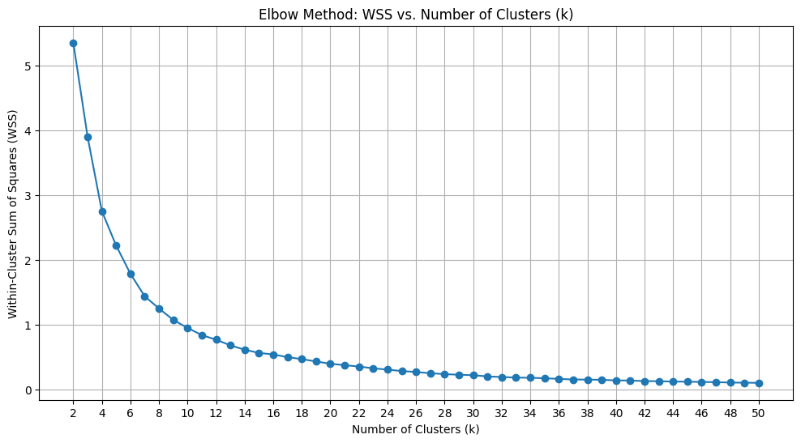
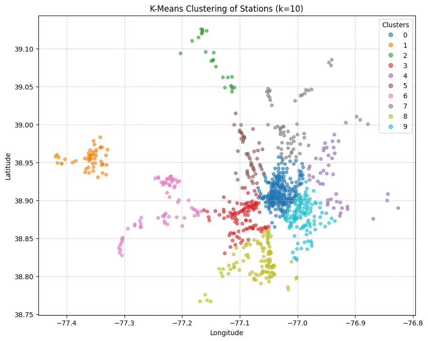
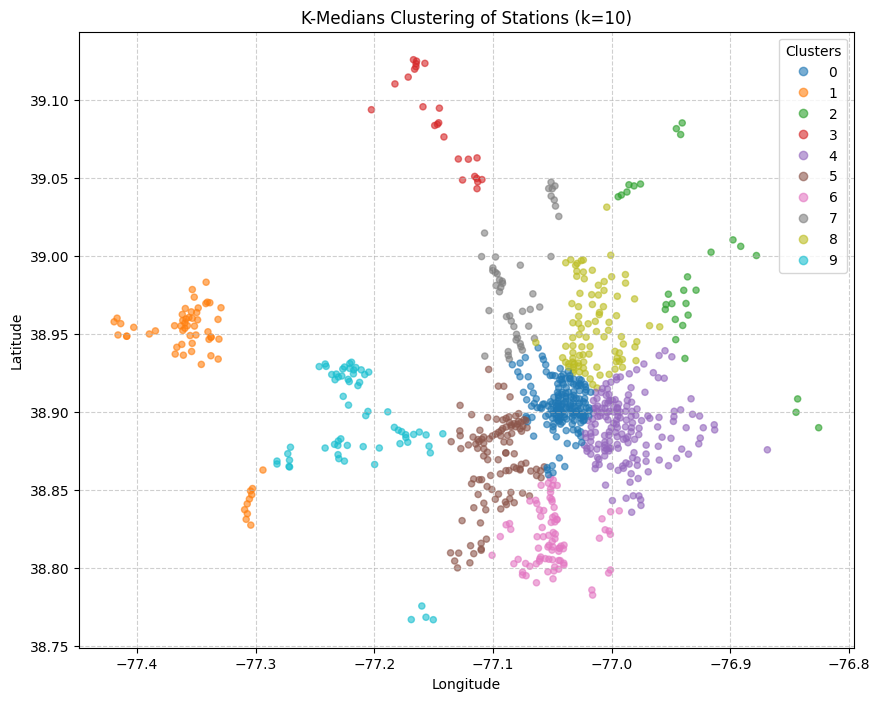
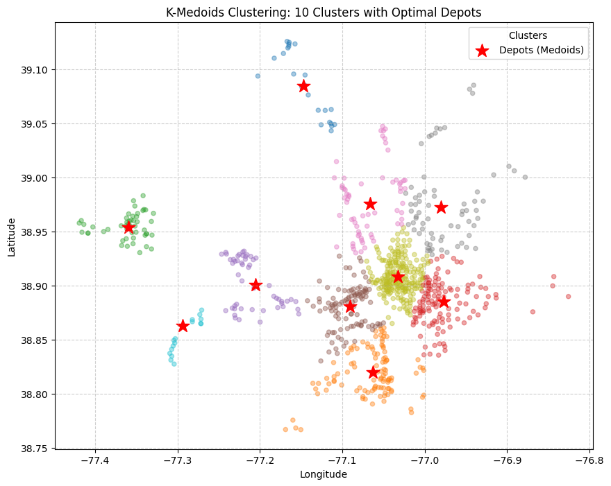
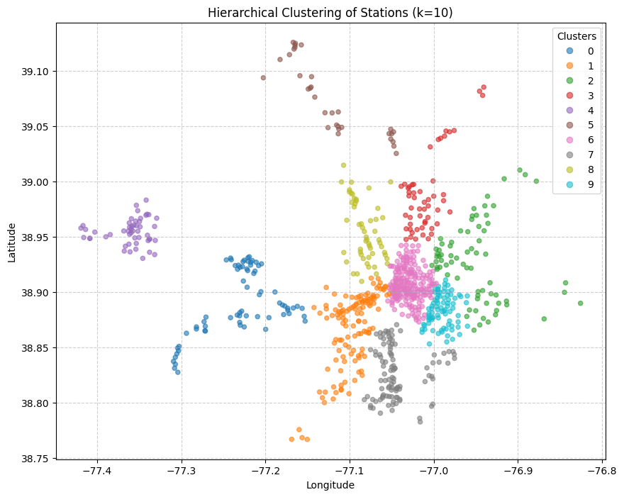

# Capital Bikeshare Network Optimization & Crew Deployment

An operations-analytics portfolio project using **2025 Capital Bikeshare station locations** to design geographic service territories and identify candidate crew depots.

**Tech:** Python · pandas · Matplotlib · scikit-learn · pyclustering  
**Methods:** K-Means · Elbow/WSS · K-Medians · K-Medoids · Hierarchical Clustering

## Business question

> How can Capital Bikeshare divide stations into practical service territories and choose existing stations as candidate crew depots?

## Source data

The source notebook reported:

- **12 monthly 2025 files**
- **6,662,647 trip records**

Raw data are intentionally excluded from GitHub.

## Main result: 10 proposed service territories

The source analysis evaluates K-Means for `k=2...50` and chooses **k=10** from the elbow/WSS curve as a practical crew-count tradeoff.



## Method comparison

### K-Means


### K-Medians


### K-Medoids


### Hierarchical clustering


## Source-reported candidate depots

| Candidate depot | Latitude | Longitude |
|---|---:|---:|
| Rockville Metro West | 39.084379 | -77.146866 |
| Commonwealth Ave & E Monroe Ave | 38.820058 | -77.062821 |
| Reston Town Center Metro North | 38.953691 | -77.359717 |
| Stadium Armory Metro | 38.885483 | -76.977187 |
| Pimmit Dr & Los Pueblos Ln | 38.900371 | -77.205428 |
| Washington Blvd & 7th St N | 38.880810 | -77.090792 |
| Western Ave & Pinehurst Cir NW | 38.975739 | -77.066409 |
| Riggs Rd & East West Hwy | 38.972500 | -76.980700 |
| 14th St & Rhode Island Ave NW | 38.908600 | -77.032300 |
| Fair Woods Pkwy & Fairfax Blvd | 38.862804 | -77.293922 |

A CSV copy is in `results/recommended_depots.csv`.

## Operational recommendation

Within the source assignment, **K-Medoids** is the most operationally attractive approach because each center is an actual bike station rather than an artificial coordinate.

The final portfolio treats these as **candidate depots**, not deployment-validated facilities.

## Important limitations

A real deployment model should also consider:

- street-network travel time rather than raw coordinate distance;
- trip demand and rebalancing workload;
- station capacity and maintenance demand;
- balanced workload across crews;
- physical depot feasibility;
- staffing and operating cost constraints.

## Repository structure

```text
capital-bikeshare-network-optimization/
├── README.md
├── notebooks/
│   └── station_clustering_crew_deployment.ipynb
├── images/
├── results/
│   ├── recommended_depots.csv
│   └── method_comparison.csv
├── data/
│   ├── README.md
│   └── raw/
├── requirements.txt
├── .gitignore
└── UPLOAD_CHECKLIST.md
```

## AI-assistance disclosure

Generative AI tools were used during the original coursework to assist with code drafting/debugging and written explanations. Source outputs and interpretations were reviewed by the author. This portfolio version reorganizes the applied work for professional presentation.

## Author

**Franbon Ahmed**  
MS Business Analytics, George Washington University
